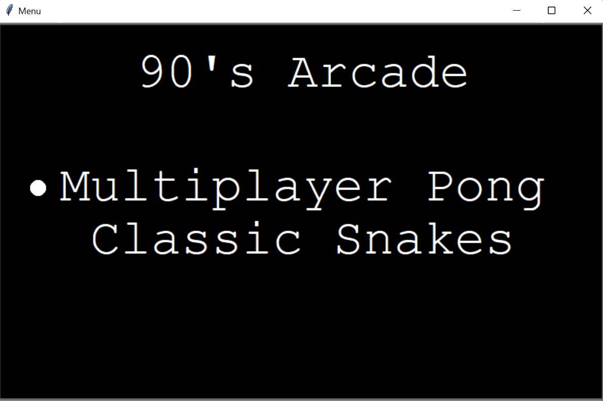
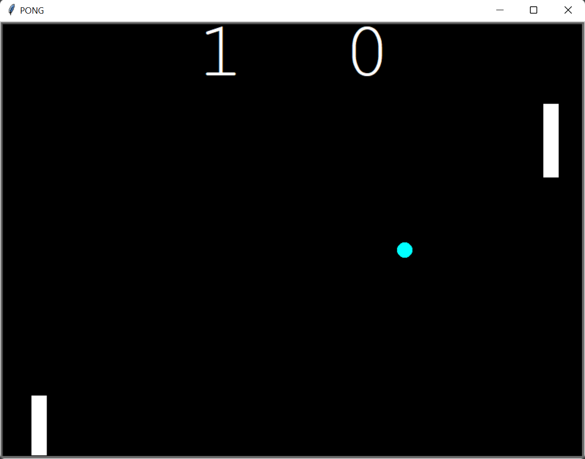
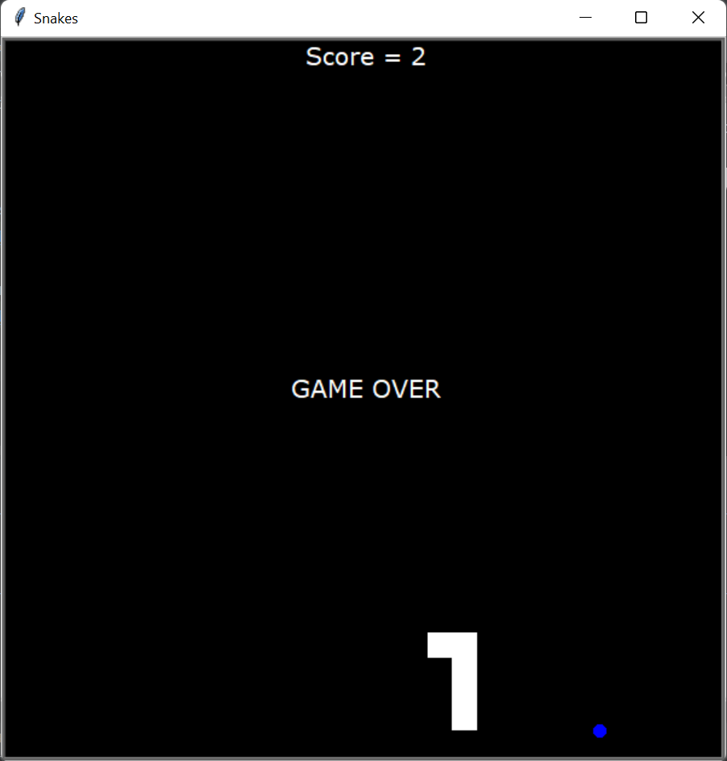
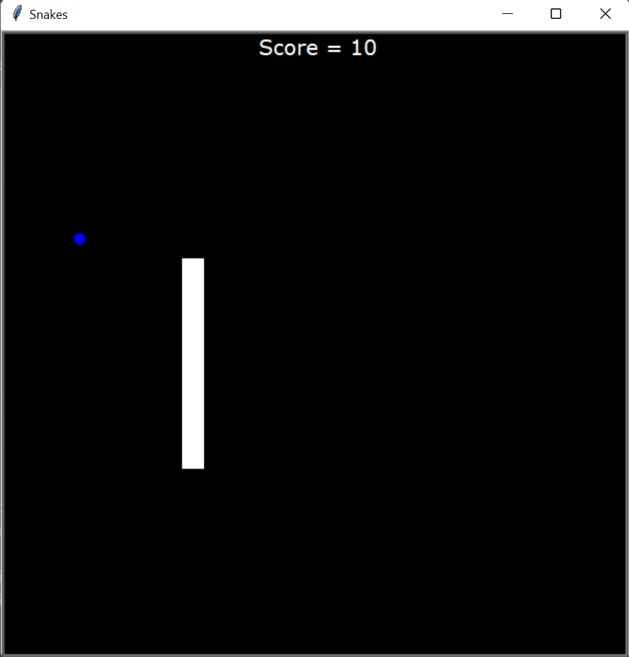

Hola.  
This projects contains 2 implementation of classic games using turtle :  
1) Pong (Multiplayer) : a table tennis–themed twitch arcade sports video game  
2) Snake : game where the player maneuvers a growing line that becomes a primary obstacle to itself  

Basic user interface to navigate and select between the games 

Pong : Two players could play at the same time using up, down and w, s keys 
The ball will increase it speed following every hit with the player slab hence increasing the difficulty at each level

Snake : Beware of crashing into the walls of crashing into yourself 

The snake could be controlled by using up, down, right and left keys.
 
No external dependencies are required